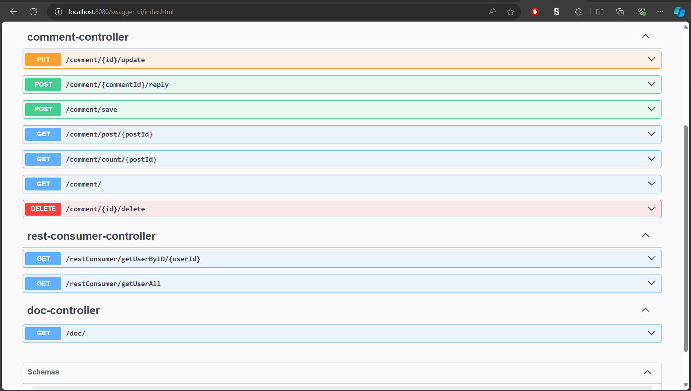
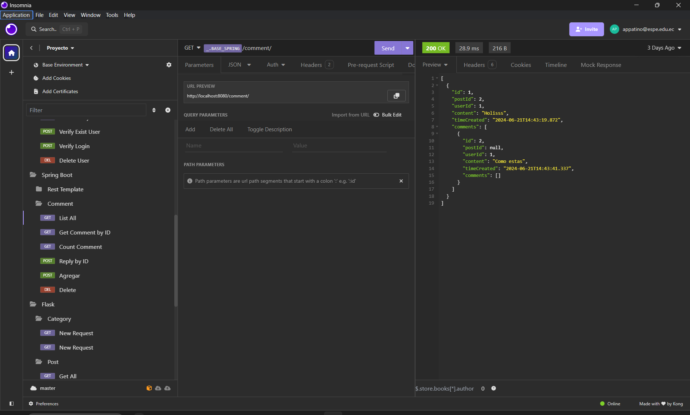

# **Select Language:** 🌍
- [Español (Spanish)](README-es.md)
- [English](README.md)

# Comment and Like Microservice

## Descripción

Este proyecto es un microservicio de comentarios y likes desarrollado con Spring Boot. Permite a los usuarios agregar, actualizar, eliminar y contar comentarios, así como dar likes a las publicaciones. Además, se incluye un consumidor REST para interactuar con otro microservicio que maneja la información de los usuarios.

## RESULTS
## REST CONSUMER
### Swagger Documentation

### APIS


## Estructura del Proyecto

El proyecto está organizado en los siguientes paquetes:

- `controller`: Contiene los controladores REST.
- `model`: Define los modelos de datos.
- `repository`: Gestiona el almacenamiento y acceso a los datos.
- `service`: Contiene la lógica de negocio.
- `config`: Configuraciones del entorno de la aplicación.

## Endpoints

### CommentController

- **GET /comment/**: Obtiene todos los comentarios.
- **POST /comment/save**: Agrega un nuevo comentario.
- **PUT /comment/{id}/update**: Actualiza un comentario existente.
- **DELETE /comment/{id}/delete**: Elimina un comentario por ID.
- **GET /comment/count/{postId}**: Cuenta los comentarios de una publicación.
- **GET /comment/post/{postId}**: Obtiene los comentarios de una publicación.
- **POST /comment/{commentId}/reply**: Agrega una respuesta a un comentario.

### DocController

- **GET /doc/**: Redirige a la documentación Swagger.

### RestConsumerController

- **GET /restConsumer/getUserAll**: Obtiene todos los usuarios en formato JSON desde otro microservicio.
- **GET /restConsumer/getUserByID/{userId}**: Obtiene un usuario por ID desde otro microservicio.

## Modelos de Datos

### Comment

```java
public class Comment {
    private Long id;
    private Long postId;
    private Long userId;
    private String content;
    private LocalDateTime timeCreated;
    private List<Comment> comments;

    // Constructor sin argumentos
    public Comment() {
        this.comments = new ArrayList<>();
    }
}
```

### CommentResponse

```java
public class CommentResponse {
    private Long id;
    private Long commentId;
    private Long userId;
    private String content;
    private LocalDateTime timeCreated;
}
```

### Like

```java
public class Like {
    private Long likeId;
    private Long postId;
    private Long userId;
    private boolean liked;
}
```

## Configuración

### RestConsumerRepository

Este repositorio se comunica con otro microservicio utilizando `RestTemplate`.

```java
@Repository
public class RestConsumerRepository {
    private final String BASE_URL;
    private final String API_USER;
    private final RestTemplate restTemplate = new RestTemplate();

    @Autowired
    public RestConsumerRepository(AppEnvironment appEnvironment) {
        this.BASE_URL = appEnvironment.getBaseUrl();
        this.API_USER = appEnvironment.getApiUserPath();
    }

    public String getUserAsJson() {
        ResponseEntity<String> response = restTemplate.getForEntity(BASE_URL + API_USER, String.class);
        return response.getBody();
    }

    public String getUserByID(Long userId) {
        return restTemplate.getForObject(BASE_URL + API_USER + "/" + userId, String.class);
    }
}
```

## Instalación y Ejecución

1. Clona el repositorio.
2. Navega al directorio del proyecto.
3. Configura las propiedades de la aplicación en `application.properties`.
4. Ejecuta el proyecto con Maven o tu IDE preferido.

```sh
mvn spring-boot:run
```

## Documentación API

La documentación de la API está disponible en `/swagger-ui.html`.

## Contribuciones

Las contribuciones son bienvenidas. Por favor, abre un issue o un pull request en GitHub.

## Licencia

Este proyecto está licenciado bajo la Licencia MIT.

