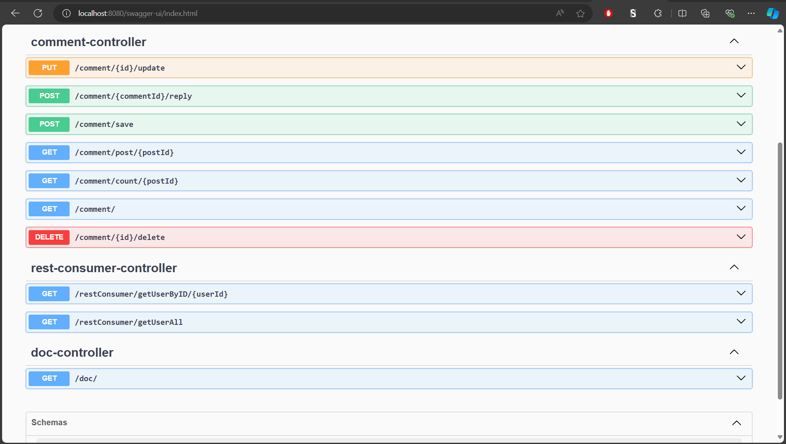
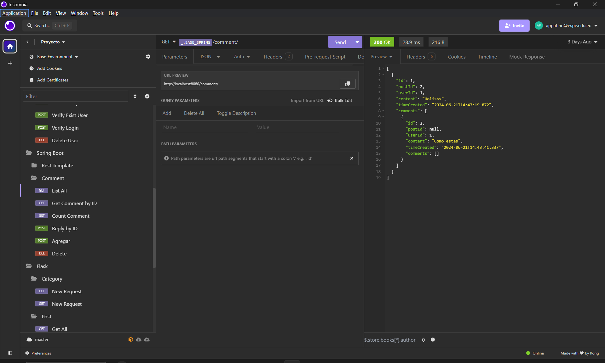

# **Select Language:** 🌍
- [Español (Spanish)](README-es.md)
- [English](README.md)

# Comment and Like Microservice

## Description

This project is a comment and like microservice developed with Spring Boot. It allows users to add, update, delete, and count comments, as well as like posts. Additionally, it includes a REST consumer to interact with another microservice that handles user information.

## RESULTS
## REST CONSUMER
### Swagger Documentation

### APIS


## Project Structure

The project is organized into the following packages:

- `controller`: Contains the REST controllers.
- `model`: Defines the data models.
- `repository`: Manages data storage and access.
- `service`: Contains the business logic.
- `config`: Application environment configurations.

## Endpoints

### CommentController

- **GET /comment/**: Retrieves all comments.
- **POST /comment/save**: Adds a new comment.
- **PUT /comment/{id}/update**: Updates an existing comment.
- **DELETE /comment/{id}/delete**: Deletes a comment by ID.
- **GET /comment/count/{postId}**: Counts the comments for a post.
- **GET /comment/post/{postId}**: Retrieves comments for a post.
- **POST /comment/{commentId}/reply**: Adds a reply to a comment.

### DocController

- **GET /doc/**: Redirects to the Swagger documentation.

### RestConsumerController

- **GET /restConsumer/getUserAll**: Retrieves all users in JSON format from another microservice.
- **GET /restConsumer/getUserByID/{userId}**: Retrieves a user by ID from another microservice.

## Data Models

### Comment

```java
public class Comment {
    private Long id;
    private Long postId;
    private Long userId;
    private String content;
    private LocalDateTime timeCreated;
    private List<Comment> comments;

    // No-argument constructor
    public Comment() {
        this.comments = new ArrayList<>();
    }
}
```

### CommentResponse

```java
public class CommentResponse {
    private Long id;
    private Long commentId;
    private Long userId;
    private String content;
    private LocalDateTime timeCreated;
}
```

### Like

```java
public class Like {
    private Long likeId;
    private Long postId;
    private Long userId;
    private boolean liked;
}
```

## Configuration

### RestConsumerRepository

This repository communicates with another microservice using `RestTemplate`.

```java
@Repository
public class RestConsumerRepository {
    private final String BASE_URL;
    private final String API_USER;
    private final RestTemplate restTemplate = new RestTemplate();

    @Autowired
    public RestConsumerRepository(AppEnvironment appEnvironment) {
        this.BASE_URL = appEnvironment.getBaseUrl();
        this.API_USER = appEnvironment.getApiUserPath();
    }

    public String getUserAsJson() {
        ResponseEntity<String> response = restTemplate.getForEntity(BASE_URL + API_USER, String.class);
        return response.getBody();
    }

    public String getUserByID(Long userId) {
        return restTemplate.getForObject(BASE_URL + API_USER + "/" + userId, String.class);
    }
}
```

## Installation and Execution

1. Clone the repository.
2. Navigate to the project directory.
3. Configure the application properties in `application.properties`.
4. Run the project with Maven or your preferred IDE.

```sh
mvn spring-boot:run
```

## API Documentation

API documentation is available at `/swagger-ui.html`.

## Contributions

Contributions are welcome. Please open an issue or a pull request on GitHub.

## License

This project is licensed under the MIT License.
